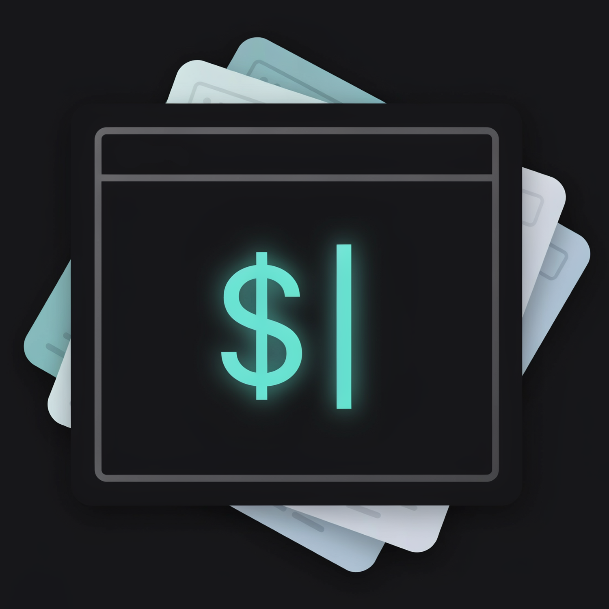

<div align="center">



# PromptBox

**A clean, fast desktop app to organize, tag, and instantly copy your AI prompt templates.**

[](https://github.com/sebbourgeois/promptbox/releases)
[](LICENSE)
[](https://www.electronjs.org/)

[Features](#features) • [Installation](#installation) • [Usage](#usage) • [Development](#development) • [Building installers](#building-installers)

</div>

PromptBox is a cross-platform Electron application for AI enthusiasts, developers, and writers who juggle a growing library of prompt templates. Keep them organized in folders, find them in seconds with search and tag filters, and copy them to your clipboard with a single click.

## Features

- **Folders** — Group related prompts into folders, with live prompt counters. Double-click a folder to rename it.
- **Search everywhere** — Filter folders by name, and search prompts by title, content, or tags. Sort results the way you like.
- **Tag filters** — Tag your prompts and narrow the list by clicking hashtag pills.
- **One-click copy** — View prompts in a clean monospace panel and copy them instantly, with visual "Copied!" feedback.
- **Dark & light themes** — Toggle between themes; your choice is remembered between sessions.
- **Zero-configuration storage** — Everything lives in a single local JSON file in your app data directory. No accounts, no cloud, no setup.
- **Backup & restore** — Export your entire library to a JSON file and import it on another machine from the sidebar footer.

## Installation

Prebuilt installers are published automatically for every release on the [Releases page](https://github.com/sebbourgeois/promptbox/releases):

| Platform | File |
| --- | --- |
| Windows | `.exe` (NSIS installer) |
| macOS | `.dmg` |
| Linux | `.AppImage` |

Download the file for your platform and run it.

> [!NOTE]
> Builds are currently unsigned, so Windows SmartScreen and macOS Gatekeeper may show a warning on first launch.

## Usage

On first launch, PromptBox seeds a **Getting Started** folder with a welcome prompt that walks you through the basics:

1. Create folders in the left sidebar to organize your prompts.
2. Add prompts with a title, content, and optional tags.
3. Use the search fields and tag pills to filter your library.
4. Select a prompt and hit the copy button — it's on your clipboard.

### Where your data lives

Your library is stored as `prompts-db.json` in the standard app data directory for your OS (e.g. `%APPDATA%/promptbox` on Windows, `~/Library/Application Support/promptbox` on macOS, `~/.config/promptbox` on Linux).

> [!TIP]
> Use the export button in the sidebar footer to create timestamped JSON backups — they're plain files, easy to version or sync however you prefer.

## Development

You only need [Node.js](https://nodejs.org/) (which includes `npm`) installed.

```bash
git clone https://github.com/sebbourgeois/promptbox.git
cd promptbox
npm install
npm start
```

The app is intentionally dependency-free at runtime: plain HTML, vanilla CSS, and vanilla JavaScript on top of Electron, with a small IPC surface between the main and renderer processes (`main.js`, `preload.js`, `renderer.js`).

## Building installers

PromptBox uses [electron-builder](https://www.electron.build/) to package binaries into the `dist/` folder:

| Platform | Command | Output |
| --- | --- | --- |
| Windows | `npm run build:win` | `.exe` (NSIS installer) |
| macOS | `npm run build:mac` | `.dmg` |
| Linux | `npm run build:linux` | `.AppImage` |
| All | `npm run build:all` | All of the above |

Build parameters (app id, product name, targets, icons) live in the `"build"` block of [package.json](package.json).

> [!IMPORTANT]
> macOS `.dmg` packages can only be built on a macOS machine. For public distribution without OS warnings, you'll also need code-signing certificates (Apple Developer Program for macOS, Authenticode for Windows).

### Releases

Releases are fully automated: bump `"version"` in `package.json` and push to `master`. The [release workflow](.github/workflows/release.yml) tags the version, builds installers for all three platforms, and publishes them as a GitHub Release. Pushes that don't change the version are no-ops.